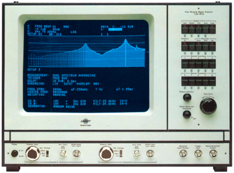
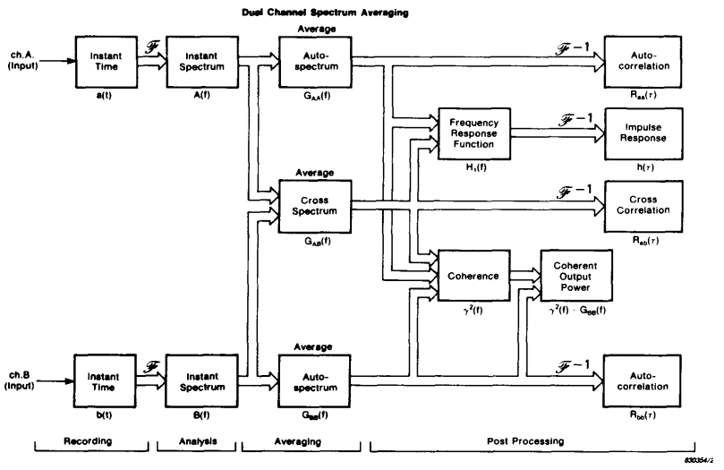
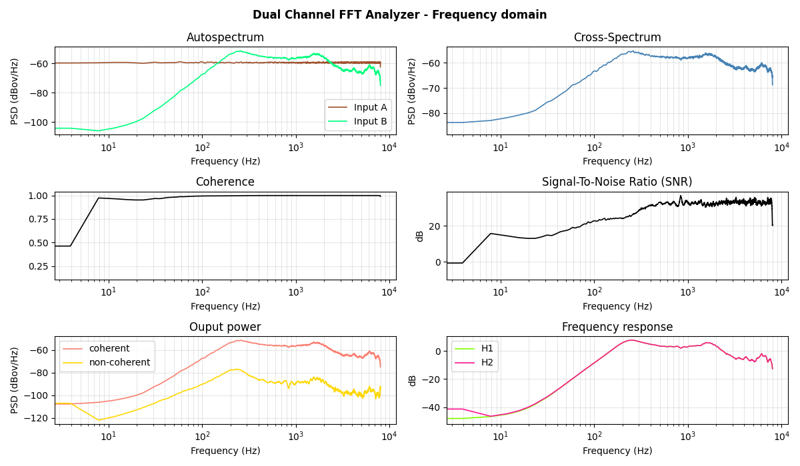
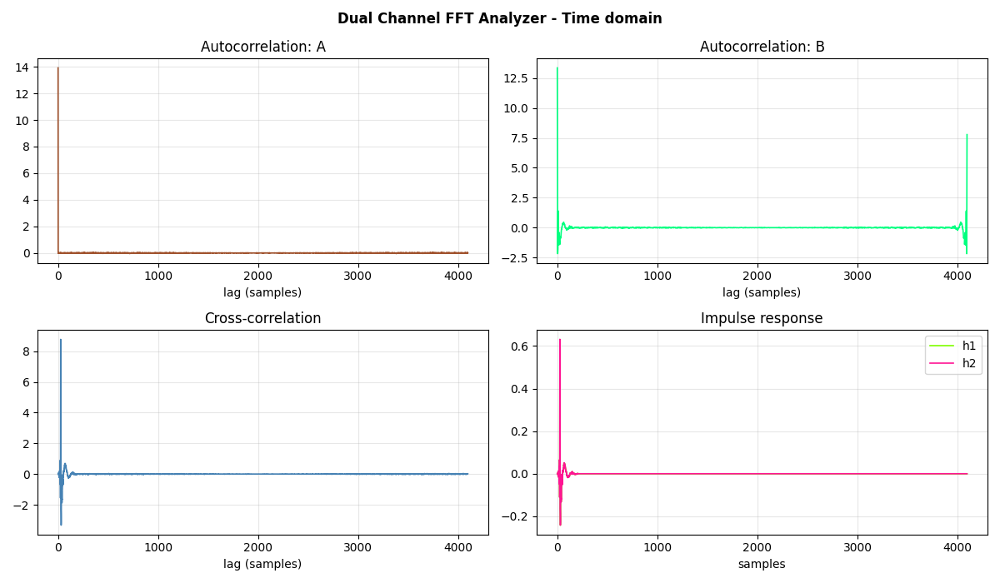

# Dual Channel FFT Analyzer

<p align="center">
  
</p>

Python package that models an old **Dual Channel FFT Analyzer**, taking some of the functionality of the *Brüel & Kjær Dual Channel Signal Analyzer Type 2032/2034* as a reference. The purpose of the application is merely educational to show concepts like *autospectrum*, *cross-spectrum*, *coherence*, *frequency response* estimation, etc.

The tools is a command line interface (CLI) which consumes audio recordings in *.wav* format, representing the inputs for Channels A and B. It outputs:

- **Autocorrelation** and **Autospectrum** of channels A and B
- **Cross-Correlation** and **Cross-Spectrum** between channels A and B
- **Coherence** and **Coherent Output Power**
- **Signal-To-Noise Ratio (SNR)**
- **Impulse response** between channels A and B
- **Frequency response** between channels A and B

## Block diagram of the system
From reference **[1]**



## Tech Stack
- Python
- [Numpy](https://numpy.org/)
- [Scipy](https://scipy.org/)

## Requirements
See ```requirements.txt```

## Usage
In addition to the Python module, which could be imported and used directly from another Python code, there is a command line interface available (```cli.py```). Type ```python dual_channel_fft_analyzer/cli.py -h``` for help.
```
usage: cli.py [-h] [-v] [-p] [--nfft NFFT] [--overlap OVERLAP] [--window WINDOW] [--spectrumtype {power,psd}] [--delay DELAY] input_a input_b

Dual Channel FFT Analyzer

positional arguments:
  input_a               path to the recording (wav) used as input for Channel A
  input_b               path to the recording (wav) used as input for Channel B

optional arguments:
  -h, --help            show this help message and exit
  -v, --verbose         enable verbose mode (default: False)
  -p, --plot            plot results (default: False)
  --nfft NFFT           FFT length (default: 512)
  --overlap OVERLAP     percentage to overlap between segments when averaging (default: 50)
  --window WINDOW       window type used for the analysis. It can be any Scipy-compatible window (default: hann)
  --spectrumtype {power,psd}
                        power spectrum scaling (default: psd)
  --delay DELAY         propagation delay to compensate in ms (default: 0)
```

## Example: Output plots


## References
**[1]** Herlufsen, H. (1984) Dual Channel FFT Analysis (Part I). Brüel & Kjær Technical Review No. 1-1984. [Link](https://www.bksv.com/pdf/bv0013.pdf)

**[2]** Herlufsen, H. (1984) Dual Channel FFT Analysis (Part II). Brüel & Kjær Technical Review No. 2-1984. [Link](https://www.bksv.com/pdf/bv0014.pdf)

## Author
Antonio Peiro ([LinkedIn](https://es.linkedin.com/in/antoniopeiro))
